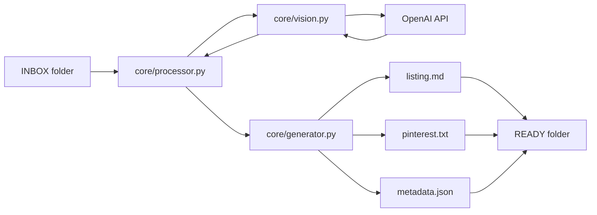
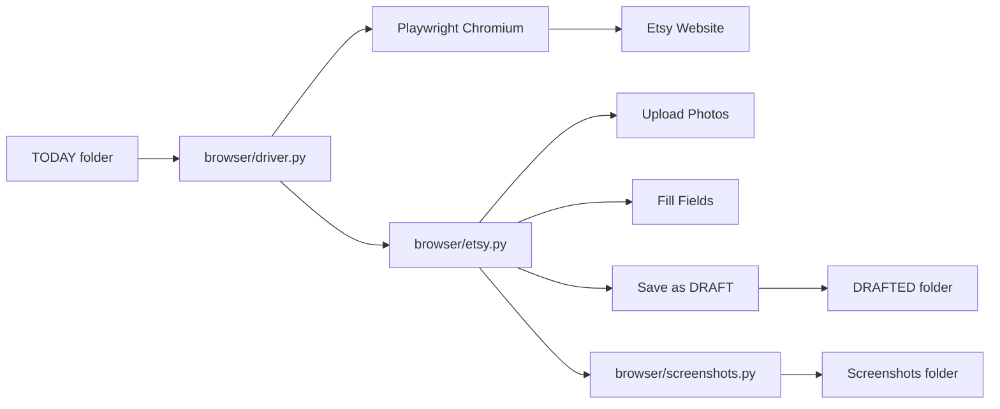
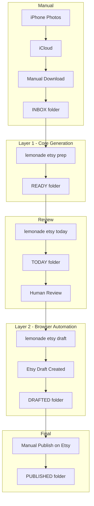

# Lemonade Architecture Plan

## Proposed Repository Structure

```
Lemonade/
├── agents.md                    # Contract for all agent behavior
├── README.md                    # Project overview
├── pyproject.toml               # Python project config, dependencies
├── .gitignore                   # Git ignore patterns
├── .env.example                 # Example environment variables
│
├── lemonade/                    # Main Python package
│   ├── __init__.py
│   ├── __main__.py              # Entry point for `python -m lemonade`
│   ├── cli.py                   # CLI command definitions
│   ├── config.py                # Configuration and paths
│   │
│   ├── core/                    # LAYER 1: Safe generation logic
│   │   ├── __init__.py
│   │   ├── processor.py         # Main processing orchestrator
│   │   ├── vision.py            # OpenAI image analysis
│   │   ├── generator.py         # Text generation for listings
│   │   ├── templates.py         # Fixed text templates
│   │   └── shipping.py          # Shipping profile logic
│   │
│   └── browser/                 # LAYER 2: Isolated browser automation
│       ├── __init__.py
│       ├── driver.py            # Playwright browser management
│       ├── etsy.py              # Etsy-specific automation
│       └── screenshots.py       # Screenshot capture logic
│
├── tests/                       # Test files
│   ├── __init__.py
│   ├── test_core.py
│   └── test_shipping.py
│
└── plans/                       # Planning documents
    └── architecture.md          # This file
```

---

## Layer Separation Explained

### Layer 1 — CORE GENERATION



**Key files:**
- [`lemonade/core/processor.py`](lemonade/core/processor.py) — Orchestrates the entire generation flow
- [`lemonade/core/vision.py`](lemonade/core/vision.py) — Sends images to OpenAI, extracts product details
- [`lemonade/core/generator.py`](lemonade/core/generator.py) — Creates listing text, Pinterest copy
- [`lemonade/core/shipping.py`](lemonade/core/shipping.py) — Determines shipping profile based on rules

**Isolation guarantee:** This layer has ZERO imports from `lemonade/browser/`. It cannot accidentally trigger browser actions.

---

### Layer 2 — BROWSER DRIVER



**Key files:**
- [`lemonade/browser/driver.py`](lemonade/browser/driver.py) — Manages Playwright browser instance with persistent profile
- [`lemonade/browser/etsy.py`](lemonade/browser/etsy.py) — Etsy-specific page interactions
- [`lemonade/browser/screenshots.py`](lemonade/browser/screenshots.py) — Captures screenshots at each step

**Isolation guarantee:** This layer reads from TODAY folder but NEVER modifies INBOX or READY. It only moves completed items to DRAFTED.

---

## Data Flow



---

## CLI Command Mapping

| Command | Layer | Action |
|---------|-------|--------|
| `lemonade etsy prep` | Core | Process INBOX to READY |
| `lemonade etsy today` | Core | Move READY to TODAY, display |
| `lemonade etsy dry-run` | Core | Preview without browser |
| `lemonade etsy status` | Core | Show queue counts |
| `lemonade etsy draft` | Browser | Create Etsy draft |
| `lemonade etsy pause` | Browser | Stop before Save Draft |
| `lemonade etsy screenshots` | Browser | View saved screenshots |

---

## First Terminal Commands

After you confirm this plan, run these commands:

```cmd
:: 1. Create queue directories
mkdir C:\tresor\etsy\queue\INBOX
mkdir C:\tresor\etsy\queue\READY
mkdir C:\tresor\etsy\queue\TODAY
mkdir C:\tresor\etsy\queue\DRAFTED
mkdir C:\tresor\etsy\queue\PUBLISHED

:: 2. Initialize Python project
cd C:\Users\baboe\OneDrive\Documenten\GitHub\Lemonade
python -m venv .venv
.venv\Scripts\activate
pip install --upgrade pip
```

---

## Dependencies (Minimal)

```toml
[project]
dependencies = [
    "click>=8.0",           # CLI framework
    "openai>=1.0",          # OpenAI API
    "playwright>=1.40",     # Browser automation
    "rich>=13.0",           # Terminal formatting
]
```

---

## Questions Before Proceeding

1. Does the queue path `C:\tresor\etsy\queue\` work for you, or do you prefer a different location?
2. Do you already have an OpenAI API key set up?
3. Should I proceed with creating the Python project structure?
